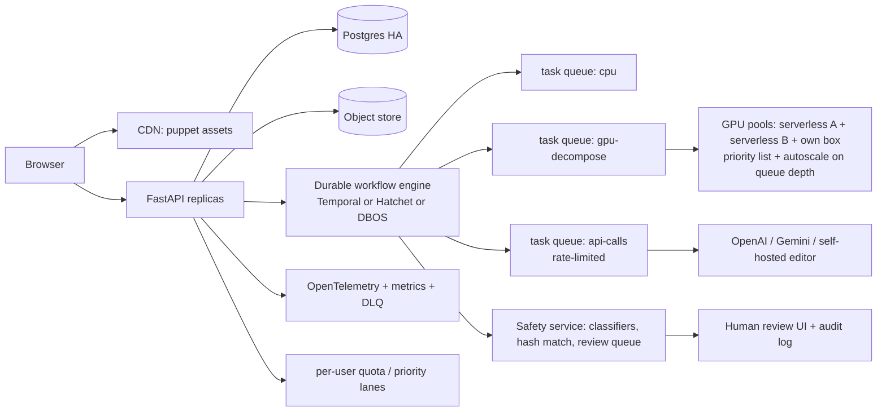

# img2live 서비스화 조사 보고서: 호스팅·오케스트레이션·브라우저 런타임·법무·평가·MVP (기준일 2026-10-02)

작성 방식: 2026-10-02 에 WebSearch/WebFetch/curl/`gh api`/HF API 로 직접 확인했고, 로컬 See-through 클론(`<local clone of see-through>`)을 직접 읽었다. 개발 머신에는 GPU 가 없어서 **추론 속도·VRAM 은 직접 측정하지 못했다.** 속도 숫자는 모두 README·논문 값이거나 추정이다.

## 0. 읽는 법 (신뢰도 표기)

| 표기 | 뜻 | 분류 |
|---|---|---|
| [V] | 1차 자료의 원문을 이번 세션에 직접 읽음 (로컬 파일, HF 원문 README/LICENSE, HF/GitHub/npm API, 벤더 원문 HTML, 법령·논문 원문) | VERIFIED |
| [V~] | 공식 페이지를 WebFetch(요약 모델 경유)로 읽음. 추출 오류 가능성은 있으나 출처가 1차 | VERIFIED (요약 경유) |
| [U2] | 2차 자료(집계 사이트, 블로그, 뉴스, 검색 결과 요약)만 근거 | UNVERIFIED |
| [U] | 내 추정, 일반 지식, 또는 1차 자료를 못 열어서 확인 못 함 | UNVERIFIED |

출처 번호 [S#] 는 문서 끝 "Sources" 절에 있다.

---

## 1. 결론 먼저 (의사결정에 필요한 12줄)

1. **See-through 가중치는 상용 SaaS 로 쓸 수 있다. 단 "OpenRAIL 조건부"다.** 코드는 Apache-2.0 이고, LayerDiff3D·Marigold 가중치는 HF `license: openrail++` 이다(SDXL/Animagine XL 4.0/LayerDiffuse/Marigold 에서 상속). 상용 사용은 명시적으로 허용되지만, **서비스로 호스팅하면 라이선스상 "Distribution" 이므로 Attachment A 사용 제한을 우리 이용약관에 "enforceable provision"으로 넣고 사용자에게 고지**해야 한다. 저자들이 2026-09-28 이슈 #43 에서 이를 직접 확인해 줬다. [V] [S2][S3][S5][S7]
2. 저자들이 모델 카드를 **나흘 전(2026-09-28)에 고쳤다.** 예전에 "Apache-2.0"으로 보이던 LayerDiff3D 카드는 불완전했다고 인정했다. 옛 스냅샷·포크·블로그를 근거로 삼으면 안 된다. 사용 시점의 HF 커밋 해시를 고정하고 LICENSE/NOTICE 를 같이 보관할 것. [V] [S5]
3. **학습 데이터 출처가 가장 큰 잔여 법적 리스크다.** 논문에 따르면 ArtStation·Booth·DeviantArt 에서 모은 "상용 Live2D 모델" 9,102 개(증강 후)로 학습했고, 라이선스/윤리 진술은 없다. 저자의 상용 허용 선언에도 이 리스크는 사라지지 않는다(면책 없음). [V] [S6]
4. **서빙 경로에 넣으면 안 되는 구성요소가 있다:** `bizarre-pose-estimator`(AGPL-3.0, See-through `bizarre_tagger` 가 이 가중치를 로드), Depth Anything V2 Large 이상(CC-BY-NC-4.0), FLUX.2-klein-9B(비상업), ComfyUI(GPL-3.0)·RunPod `worker-comfyui`(AGPL-3.0). 메인 추론(`inference_psd.py`)은 **LayerDiff3D + Marigold + 휴리스틱 후처리(LaMa 는 좌우 분할 시 선택적)** 만 필요하다. [V] [S1][S12][S13][S39]
5. **GPU: MVP 는 scale-to-zero 서버리스 + 이식 가능한 GPU 워커 컨테이너.** 1건(150초 가정)당 웜 상태 GPU 비용은 RunPod Serverless 4090급 약 $0.046, Modal L40S 약 $0.081 이다. 콜드스타트·유휴 시간을 얹은 고립 요청은 $0.08–0.15. 월 약 4천–1만 건을 넘고 가동률이 높아지면 24/7 팟(4090 $0.34–0.74/h)이 유리해진다. [V] 가격 / [U] 150초와 콜드스타트 길이 [S20][S24]
6. **RTX 5090 을 사는 건 지금 불리하다.** 2차 자료 기준 시중가가 평균 $4.7k 이상(MSRP $1,999)인 반면 임대는 $0.99/h(RunPod Secure) 수준이다. [U2] [S24][S38]
7. **오케스트레이션: MVP 는 "Postgres 상태기계 + Redis 큐(RQ 등) + SSE"로 충분.** 사용자 보정(HITL)은 워커를 붙잡지 말고 "awaiting_review 상태 + 두 개의 잡"으로 분리한다. 단계 그래프가 복잡해지면 Postgres 만으로 도는 DBOS Transact(MIT) 또는 Hatchet(MIT)로, 그 이상은 Temporal 로. Arq 는 **maintenance only** 라 신규 채택 금지. [V] [S40][S41]
8. **MinIO 오픈소스 저장소는 archived/unmaintained**(마지막 릴리스 2025-10-15, AGPL-3.0)다. 자체 서버 오브젝트 스토어는 SeaweedFS(Apache-2.0)나 RustFS(Apache-2.0, 1.0.0), 또는 Cloudflare R2($0.015/GB-월, egress 무료)를 검토. [V] [S46][S48]
9. **브라우저: 기준 렌더러는 WebGL2(전 세계 96.4%).** WebGPU 는 85.7%(+부분 3.1%)이고 Safari/Firefox 는 조건부 기본 활성이며, PixiJS v8 문서는 지금도 "프로덕션은 WebGL 렌더러 권장"이라고 적는다. 변형(deform)은 CPU keyform/shape-key 블렌딩 + 동적 버퍼 업로드로 시작. [V] [S50][S51]
10. **Cubism/Inox2D 에 의존하지 말 것.** Cubism Core 는 독점이고(연매출 1천만 엔 이상 사업자는 SDK 릴리스 라이선스 필요), Inox2D 는 스스로 "프로토타입, 프로덕션 비권장"이라 한다. 재사용할 만한 건 MIT 의 **StretchyStudio**(편집기)와 **Anime2.5DRig**(자동 리그+MediaPipe) 코드 구조다. [V] [S53][S55][S56][S57]
11. **업로드 UGC 위험은 애니 스타일 서비스라서 구조적으로 크다.** 한국은 만화·애니 캐릭터 아동성착취물의 배포·소지 처벌이 2026-06 헌재 전원일치 합헌으로 확인됐다(대법원 2019 판결도 교복 입은 만화 캐릭터를 청소년 인식 가능 표현물로 봄). 미국 ESP 는 "실제 인지" 시 NCMEC 신고 의무가 있고(스캔 의무는 없음), 보존기간은 1년이다. OpenAI moderation 엔드포인트는 CSAM 을 탐지하지 못한다고 스스로 밝힌다. **MVP 는 NSFW 전면 차단 + 공개 갤러리 없음(기본 비공개)이 비용 대비 가장 안전하다.** [V~] [S70][S71][S78]
12. **상용 이미지 API(OpenAI/Gemini)는 MVP 에서 빼자.** 비용($0.13–0.27/퍼펫)보다 정책 리스크가 크다(Gemini 는 프롬프트·출력 55일 보관, 위반 시 키 정지에서 "다른 Google 서비스 접근 영구 차단"까지 에스컬레이션). 표정 변형은 후속 단계에서 자체 호스팅(Apache-2.0: FLUX.2-klein-4B, Qwen-Image-Edit-2511)로 대체 검토. [V~] [S79][S14]

---

## 2. GPU 추론 호스팅 (2026-10)

### 2.1 워크로드 정의 (README·논문·HF 실측)

- 단일 이미지당 SDXL 기반 LayerDiff3D(body 13 태그 → head 11 태그, 두 단계 연속)와 Marigold depth. bf16 1280 해상도 기준 VRAM **약 12–16 GB**, 그룹 오프로드 시 약 10 GB(약 1.5배 느림), NF4 8 GB. [V] [S1]
- README: HF ZeroGPU 데모에서 **1280 해상도 약 2–3분**, 등록 사용자 하루 1–2건. 논문: **RTX 4090 에서 1024×1024 기준 layer decomposition 약 74초 + depth 약 10초**. 1280 해상도(픽셀 1.56배)+두 단계를 감안하면 4090급에서 **약 130–200초**가 합리적이라 **150초를 기준값**으로 쓴다. [V] README/논문 수치, [U] 150초 외삽 [S1][S6]
- 가중치 크기(HF API 실측): LayerDiff3D **10.16 GB**(unet 8.14 GB), Marigold **3.28 GB**, SAM 본문 파싱 1.29 GB(서빙 불필요), NF4 LayerDiff3D 3.76 GB. 콜드스타트 때 로드할 양은 약 13.4 GB. [V] [S2][S3]
- 추가로 런타임에 `torch.hub.load_state_dict_from_url` 로 HF 에서 LaMa(`dreMaz/AnimeMangaInpainting`) 체크포인트를 내려받는 코드가 있다 → **이미지에 굽거나 사설 미러에서 받도록 고칠 것(공급망·가용성).** [V] [S1]

### 2.2 가격표 (USD/GPU-시간, 2026-10-02 조회)

| 제공자 | GPU (VRAM) | 가격 | 과금 | 상태 |
|---|---|---|---|---|
| **Modal** (서버리스) | T4 $0.5904 / L4 $0.7992 / A10 $1.1016 / **L40S $1.9512** / A100-40 $2.0988 / A100-80 $2.4984 / RTX PRO 6000 $3.0312 / H100 $3.9492 / H200 $4.5396 / B200 $6.2496 | 초당 | Starter $0+사용량(월 $30 크레딧, GPU 동시 10) / Team $250+사용량(월 $100 크레딧, GPU 동시 50). 4090/5090 없음 | [V] [S20] |
| **RunPod Serverless** (flex) | 24GB급(L4/A5000/3090) $0.69 / **4090 $1.10** / 5090 $1.58 / A6000·A40 $1.22 / **L40·L40S·6000Ada·MIG48 $1.75** / A100 $2.72 / H100 $4.79 / RTX PRO 6000 $3.49 | 초당, 워커 시작~완전 종료(시작+실행+idle 기본 5초), 올림 | 기본 지출 한도 $80/시간 | [V] 가격 [V~] 과금 [S24][S25] |
| **RunPod Pods** (온디맨드) | 4090 커뮤니티 **$0.34** / 시큐어 $0.74, 5090 $0.69 / $0.99, L40S $0.79 / $1.09, A100 PCIe $1.19 / $1.59, H100 SXM $2.69 / $3.49, RTX PRO 6000 $1.69 / $2.09, L4 $0.44 / $0.49 | 초당 | 페이지 갱신일 2026-09-27 | [V] [S24] |
| **fal** (커스텀 앱) | 머신: A100 40GB, L40 48GB, H100, RTX PRO 6000 96GB, H200, B200. 가격 페이지 표기: H100 $4.50 정가(최저 $2.49), H200 $6.00/$2.99, B200 $7.99/$5.49, RTX PRO 6000 $4.00/$1.99. A100/L40 가격은 페이지에 없음 | 초당 (SETUP·IDLE·RUNNING·DRAINING·TERMINATING 과금, PENDING·DOCKER_PULL 비과금) | | [V~] [S26][S27] |
| **Replicate** | T4 $0.81 / L40S $3.51 / A100-80 $5.04 / H100 $5.49 (초당) | 비공개 모델은 setup·idle·active 모두 과금 | Cog 로 패키징 | [V~] [S28] |
| **Baseten** | T4 $0.631 / L4 $0.848 / A10G $1.207 / A100 $4.00 / H100 MIG $3.75 / H100 $6.50 / B200 $9.98 | 분 단위, 스케일 0 이면 미과금 | | [V~] [S29] |
| **HF Inference Endpoints / Spaces** | T4 $0.50 / L4 $0.80 / A10G $1.00 / **L40S $1.80** / A100 $2.50 / H100 $4.50. ZeroGPU 는 Spaces 용(PRO $9/월, 8배 쿼터) | 시간 | ZeroGPU 는 프로덕션 백엔드가 아니라 개인 쿼터 모델 | [V~] [S32] |
| **Google Cloud Run GPU** | L4 **$0.0001867/초(=$0.672/h)**, RTX PRO 6000 $0.00036522/초(=$1.315/h) (zonal 중복 없음). 별도로 vCPU $0.000018/초, 메모리 $0.000002/GiB·초 | 초당 | | [V] [S31] |
| **Lambda** | A10 $1.29 / A100-40 $1.99 / A100-80 $2.79 / H100 SXM $3.99 / B200 $6.69 / GH200 $2.29 | 인스턴스(서버리스 아님) | | [V~] [S30] |
| **CoreWeave** | L40S $2.25 / A100 $2.70 / H100 $6.16 / RTX PRO 6000 BW $2.50 (8-GPU 노드 가격÷8) | 노드 단위 | 소규모에 부적합 | [V~] [S33] |
| **Together AI** | 전용 H100 $5.49, B200 $8.99. 전용 엔드포인트는 LLM 중심, 커스텀 diffusion 은 가격표에 근거 없음 | | | [V~] [S33] |
| **VESSL Cloud** (한국 기업) | L40S $1.80 / A100 SXM-80 $1.48 / H100 $2.98 | 초당(온디맨드) | 리전/데이터 위치 페이지에 명시 없음 | [V~] [S34] |
| **Vast.ai** (마켓플레이스) | 4090 최저 약 $0.14–0.32, 중앙값 약 $0.44 / 5090 약 $0.21–0.41 / L40S 약 $0.47 | 초당 | 호스트별 신뢰도 편차 | [U2] [S36] |
| **Hetzner GEX45** | RTX PRO 4000 Blackwell SFF 24GB, **월 €214 + 설치 €209**(기사 2026-09-01) | 월 | 공식 정적 HTML 에 가격 없음 | [U2] [S35] |
| **Hetzner GEX131** | RTX PRO 6000 Blackwell 96GB, 월 약 €1,197 + 설치 €599(출시가 €889 에서 인상됐다는 2차 보도) | 월 | | [U2] [S35] |
| **국내 IDC** | CLOUDV: 5090 1장 서버 "월 IDC 요금 264,300원", A100-80 1장 227,800원 등(할부 11/22개월, 하드웨어 대금 별도 여부 불명). ITEASY: GPU 서버 가격은 문의, 24개월 계약 | 월 | NHN/네이버 클라우드 GPU 요금은 정적 페이지로 확인 못 함 | [V~] 페이지 내용, 총비용은 [U] [S37] |
| **자체 구매** | RTX 5090: MSRP $1,999 대비 시중 평균 약 $4.7k (재고 부족, 일부 $6k 이상) | 일시불 | | [U2] [S38] |

> Modal 과 RunPod 이 "서버리스 4090/L40S급 + 초 단위"에서 가장 싸다. Replicate/Baseten 은 같은 GPU 대비 2–3배 비싸고, Cloud Run L4 는 싸지만 L4 는 4090 대비 느려서 (추정: 2–3배, [U]) 작업당 비용 이점이 줄어든다.

### 2.3 커스텀 diffusers/ComfyUI 워크플로 호스팅 가능 여부와 콜드스타트

| 플랫폼 | 커스텀 워크플로 호스팅 | 콜드스타트 근거 | 상태 |
|---|---|---|---|
| Modal | 임의 Python/컨테이너. 함수 timeout 기본 300초, 최대 24시간. 웹 엔드포인트 HTTP 는 **150초 제한** → `spawn` 후 폴링 패턴 권장(`FunctionCall.get(timeout=0)`). `scaledown_window` 2초–20분(기본 60초), `min_containers`·`buffer_containers`, `enable_memory_snapshot` | 컨테이너 부팅 약 1초, 나머지는 import·모델 로드. SD3.5 Large Turbo(H100) 예제 콜드스타트 **"약 1분"**. 메모리 스냅샷: SD 13초 → 3.5초, torch import 5초 → 1.05초(p50). 단 당시 블로그는 "GPU 메모리는 아직 못 저장, 복원 후 GPU 로 올려야 함"이라 적었고, 이후 GPU 스냅샷(alpha)과 "3B 모델 118초 → 12초" 사례가 보도됨 | [V][V~] [S21][S22], GPU 스냅샷은 [U2] |
| RunPod Serverless | 커스텀 Docker 이미지, 큐 기반 엔드포인트(`handler`). 실행 timeout 5초–7일(기본 10분), job TTL 최대 7일, FlashBoot(기본 활성), cached models, active workers ≥ 1 이면 콜드스타트 제거, GPU 우선순위 최대 3종, 큐 지연(기본 4초)·요청 수 기반 오토스케일 | **공식 문서에 콜드스타트 수치 없음.** "큰 모델일수록 길다"만 명시 | [V~] [S25] |
| fal | `fal.App` 클래스 + `ContainerImage.from_dockerfile_str()` 커스텀 Dockerfile + 사설 레지스트리 + `exposed_port` 직접 서버 모드. `keep_alive`·`min_concurrency`·`max_concurrency`. ComfyUI 는 "SDXL Turbo 서버 배포" 공식 예제가 있음 | 수치 없음. DOCKER_PULL 대기는 비과금, `setup()` 모델 로드는 과금 | [V~][U2] [S27] |
| Replicate | Cog 패키징, Deployments(min/max 인스턴스, always-on) | 수치 없음 | [V~] [S28] |
| Baseten | Truss 로 임의 모델, 분 단위 과금 | 미확인 | [U] |
| HF Inference Endpoints | 커스텀 컨테이너/핸들러 | 미확인 | [U] |
| Cloud Run GPU | 임의 컨테이너(L4, RTX PRO 6000), 요청 기반 과금 | 미확인 | [U] |

**ComfyUI 는 서빙 경로에서 피하라.** ComfyUI 본체는 GPL-3.0, RunPod 공식 `worker-comfyui` 는 **AGPL-3.0**, `cog-comfyui` 는 MIT. See-through 는 diffusers 파이프라인(`KDiffusionStableDiffusionXLPipeline`)이라 ComfyUI 없이 `inference_utils.py` 의 `apply_layerdiff`/`apply_marigold`/`further_extr` 를 감싸서 직접 서빙하는 편이 라이선스·콜드스타트·디버깅 모두 단순하다. [V] [S1][S39]

**콜드스타트 추정 모델 [U, 직접 측정 아님]:** 이미지 pull(torch+cu128 포함 수 GB) + 가중치 13.4 GB 를 GPU 로 올리는 시간 합 = 최적화 없이 60–150초, 가중치 구움/볼륨 캐시 + (가능하면) 스냅샷이면 20–60초. 실서비스 전에 선택한 플랫폼에서 반드시 측정할 것.

### 2.4 작업당 비용 모델

```
C_job = (P_hr / 3600) * (T_run + p_cold * T_cold + T_idle) + C_cpu + C_storage + C_egress
  P_hr    : GPU 시간당 가격
  T_run   : 추론 시간 (기준 150초; 범위 90–240초)
  p_cold  : 콜드 워커를 만나는 요청 비율 (고립 요청 1.0, 꾸준한 트래픽 0.1–0.3)
  T_cold  : 콜드스타트 중 과금되는 시간 (기준 90초 가정)
  T_idle  : 요청 후 유휴(scaledown/idle timeout) 과금 시간 (Modal 기본 60초, RunPod 기본 5초)
```

계산 결과 (T_run = 150초; "콜드 포함" = T_cold 90초 + idle 30초를 한 번 얹은 고립 요청 상한) — **GPU 속도 동일 가정** [U]:

| 구성 | $/시간 | 웜 1건 | 콜드 포함 1건 |
|---|---|---|---|
| RunPod 팟 4090 커뮤니티(가동률 100%일 때만) | 0.34 | $0.0142 | $0.0255 |
| Cloud Run L4(GPU만; 속도 2배 느리면 웜 1건 약 $0.056) | 0.672 | $0.0280 | $0.0504 |
| RunPod Serverless 24GB급 | 0.69 | $0.0287 | $0.0517 |
| RunPod 팟 4090 시큐어 | 0.74 | $0.0308 | $0.0555 |
| **RunPod Serverless 4090** | 1.10 | **$0.0458** | $0.0825 |
| RunPod Serverless 5090 | 1.58 | $0.0658 | $0.1185 |
| **RunPod Serverless L40S급 (48GB)** | 1.75 | $0.0729 | $0.1313 |
| **Modal L40S** | 1.9512 | **$0.0813** | $0.1463 |
| Modal A100-40 | 2.0988 | $0.0875 | $0.1574 |
| Modal RTX PRO 6000 | 3.0312 | $0.1263 | $0.2273 |
| Baseten A100 | 4.00 | $0.1667 | $0.3000 |
| Replicate L40S | 3.51 | $0.1462 | $0.2632 |
| Replicate A100 | 5.04 | $0.2100 | $0.3780 |

- T_run 이 90초로 줄면 위 웜 값이 0.6배, 240초면 1.6배.
- **24/7 팟 손익분기:** 서버리스 평균 단가를 RunPod 4090 flex 에 150초+60초 오버헤드로 보면 $0.064/건. 이 값 기준으로 24/7 팟이 유리해지는 월 작업 수는 4090 커뮤니티 팟 약 3,900건, 4090 시큐어 팟 약 8,400건, L40S 시큐어 팟 약 12,400건이다. 24/7 팟은 가동률 20%일 때 건당 $0.07(커뮤니티)–$0.15(시큐어)로 올라가고, Hetzner GEX45(€214/월)는 100% 가동 시 €0.012, 20% 가동 시 €0.061, 5% 가동 시 €0.244(속도가 4090 급이라는 가정 없이는 비교 불가, [U]).
- **큐 사이징(Erlang-C, 푸아송 도착·서비스 150초 고정 가정, [U] 모형; "p95 대기 60초 미만"을 만족하는 최소 GPU 수):** 도착률 30/시 → 4대(p95 약 0초), 120/시 → 9대(p95 약 18초), 300/시 → 17대(p95 약 40초), 600/시 → 30대(p95 약 48초). 서버리스는 "동시 실행 상한"이 곧 처리량 상한이다: Modal Starter(GPU 동시 10)는 시간당 최대 약 240건, Team(50)은 약 1,200건. [V] 동시성 한도 [S20]
- **버스트 완충:** 1대 상시 웜(Modal `min_containers=1`, L40S, 하루 8시간 가정)은 월 약 $468(= 1.9512 × 8 × 30). 초기에는 이 비용보다 "GPU 준비 중 1–2분" UX 와 진행률 표시가 싸다.

### 2.5 권고

1. **GPU 워커를 "이식 가능한 컨테이너 한 개"로 정의**하고(상태 없음, 입력·출력은 presigned URL, HF 리비전 고정, 헬스체크), Modal·RunPod·자체 서버(docker compose + nvidia-container-toolkit) 어디서든 같은 이미지를 돌리게 한다. 제어면(API/DB/큐/뷰어)은 지금처럼 자체 서버에 둔다.
2. MVP 시작은 **Modal(Python 네이티브, 스냅샷 옵션, spawn/poll 패턴)** 또는 **RunPod Serverless(4090 $1.10/h 로 가장 저렴, FlashBoot)** 중 하나. 둘 다 1주 안에 같은 컨테이너로 A/B 측정해서 고를 것. Replicate/Baseten 은 단가 때문에 비추천.
3. 월 작업이 4천–1만 건을 넘고 트래픽이 평탄해지면 24/7 팟(시큐어 4090)이나 한국 IDC 임대/자체 구매를 검토. 구매는 5090 이 비싸므로 24GB급(4090/RTX PRO 4000급)·중고·임대 위주로 판단.
4. 해외 GPU 로 사용자 업로드를 보낼 때 국외 이전 고지를 개인정보 처리방침에 넣는다(4.5절).

---

## 3. 장기 실행 다단계 파이프라인 오케스트레이션

### 3.1 후보 비교 (GitHub API, 2026-10-02 조회) [V] [S40]

| 도구 | 최신 버전/릴리스일 | 라이선스 | 의존 | 이 프로젝트 적합도 |
|---|---|---|---|---|
| Celery | 5.6.3 / 2026-03-26 | BSD 계열(GH 는 NOASSERTION, 기억 기준 [U]) | Redis/RabbitMQ | 무난하지만 단계 상태·재개·HITL 은 직접 구현. 기본 Redis visibility timeout 이 긴 잡에서 재전달 함정 [U] |
| RQ | 2.12 / 2026-08-30 | BSD 계열(NOASSERTION, [U]) | Redis | 단순·충분(MVP 후보). `Retry`, `depends_on`, `job_timeout`, `enqueue_in` 는 기억 기준 [U] |
| **Arq** | 0.28.0 / 2026-04-16 | MIT | Redis | **README 에 "maintenance only mode"** → 신규 채택 금지 [V] [S41] |
| Dramatiq | 2.2.1 / 2026-09-02 | **LGPL-3.0** | Redis/RabbitMQ | 사용은 가능하나 LGPL 검토 필요 |
| Taskiq | 0.13.0 / 2026-09-26 | MIT | 브로커 다양 | 1.0 이전 |
| **Procrastinate** | 3.10.0 / 2026-09-23 | MIT | **Postgres 만** | 비즈니스 쓰기와 같은 트랜잭션에서 enqueue(이중 쓰기 문제 제거). MVP 후보 |
| **DBOS Transact (Py)** | 3.2.0 / 2026-09-29 | MIT | Postgres(운영 권장), 별도 서버 없음 | 단계 체크포인트·큐·`send/recv`(영속 메시지)·`set_event`·스트림으로 HITL·재개를 코드에 내장 |
| **Hatchet** | v0.107.0 / 2026-09-15 | MIT | **Postgres**(RabbitMQ 선택) | 내구성 태스크(`wait for event/sleep`, 자식 워크플로, 재생), 대시보드. 1.0 이전이지만 활발 |
| Temporal | v1.32.0 / SDK-py 1.34.0 | MIT | 서버+DB 운영 부담 큼 | signals/queries/updates 로 HITL 최강, 운영 비용 큼 |
| Prefect | 3.8.7 | Apache-2.0 | | 배치 데이터 파이프라인 지향, 요청-응답 지연 민감 서비스에는 과함 |
| Inngest | v1.45.1 | **SSPL + Apache 미래 라이선스(DOSP)** | | 자체 호스팅 시 SSPL 검토 필요 |
| Restate | v1.7.13 | "Other"(BUSL 계열로 추정, [U]) | | 비추천(라이선스 확인 필요) |

[V~] 근거: Hatchet 문서("Postgres 가 내구성 계층", RabbitMQ 선택, Lite/Compose/Helm 배포) [S42], DBOS 문서("메시지는 DB 에 영속, `recv` 에 timeout 파라미터, 별도 오케스트레이터 없음") [S43], Temporal 문서(signal/query/update) [S44], Inngest LICENSE.md 헤더가 SSPL v1 + Apache 2.0 Future License [S45].

### 3.2 요구사항별 설계

**(a) 진행률 스트리밍:** 단방향이라 **SSE** 로 충분. FastAPI 0.142.2 에 `fastapi/sse.py`(`EventSourceResponse`, `ServerSentEvent`)가 내장돼 있고(`sse-starlette` 2.x 도 BSD-3-Clause 로 활발), 웹소켓은 불필요. 재접속은 `Last-Event-ID` 와 Postgres `job_events(job_id, seq, type, payload)` 재생으로 처리, 실시간은 Redis pub/sub. [V] [S47] (웹캠 프레임·얼굴 추적은 브라우저 안에서만 처리하고 서버로 보내지 않는다.)

**(b) 멱등·콘텐츠 해시 캐시:**
- 아티팩트는 내용 해시(sha256)를 키로 저장: `artifacts(hash PK, kind, size, storage_key, refcount)`.
- 단계 캐시 키 = `sha256(stage_name || code_version || canonical_json(params) || sorted(input_artifact_hashes))`. GPU diffusion 단계는 **출력이 GPU 종류·드라이버에 따라 비트 단위로 달라질 수 있으므로** 입력+seed+모델 리비전을 키로 하고, "같은 출력"을 기대하지 않는다([U], 일반 지식). README 기본 seed 는 42. [V] [S1]
- `POST /jobs` 는 `Idempotency-Key` 헤더 + `(user_id, key)` 유일 제약.

**(c) 재개 가능한 단계:** `stages(job_id, name, status, input_key, output_key, attempts, lease_until, error)` 를 두고, 단계마다 별도 큐 잡. 워커는 `SELECT ... FOR UPDATE SKIP LOCKED` 또는 Procrastinate/RQ 로 리스를 잡고 heartbeat, 만료 리스는 리퍼가 되돌린다. 서버리스 GPU 호출은 워커가 3분을 붙잡고 있지 않도록 **제출(`spawn`/`/run`) → 상태 폴링 → 재큐(`enqueue_in`)** 로 구현(Modal 은 `FunctionCall.get(timeout=0)`, RunPod 은 `/run` + `/status`). [V~] [S21][S25]

**(d) 사람 개입(HITL):** 파이프라인을 "자동 단계 A(안전검사→분해→PSD/레이어 조립)"와 "자동 단계 B(메시+리그+패키징)"로 나누고 둘 사이를 **상태 `awaiting_review`** 로 끊는다. 워커나 워크플로 핸들을 붙잡지 않고, 사용자가 수정한 레이어를 새 해시 아티팩트로 올리면 B 가 그 해시를 입력으로 새 캐시 키로 실행된다. See-through 는 레이어를 "분할"하는 게 아니라 **확산 모델로 생성**하므로 "분할 보정"의 실체는 (1) 레이어 PNG 지우개/복원 브러시, (2) 좌우 분리선 이동(`heuristic_partseg.py seg_wlr/seg_wdepth`), (3) 특정 파트 seed 재굴림(전체 재실행 vs 머리 단계만 재실행 가능성은 [U]) 이다. [V] [S1] 검토 대기 상태에 TTL(예: 72시간)을 두고 만료되면 정리.

**(e) 아티팩트 저장·서명 URL:** S3 호환 저장소 + presigned URL(예: 10–15분 TTL, 사용자별 prefix, 버킷 비공개). **MinIO 는 쓰지 말 것**(저장소 archived, README "no longer maintained", 마지막 릴리스 2025-10-15, AGPL-3.0). 대안: SeaweedFS 4.48(Apache-2.0, 2026-09-28 릴리스), RustFS 1.0.0(Apache-2.0, 2026-09-16), Cloudflare R2(저장 $0.015/GB-월, Class A $4.50/백만, Class B $0.36/백만, egress 무료, 무료 10GB). 레이어는 bbox 로 잘라 WebP 로 서빙하고 PSD 는 요청 시 생성(저장 최소화). [V] [S46][S48]

**(f) 입력 파서 샌드박싱:** 사용자 이미지/PSD 를 파싱하는 CPU 워커는 네트워크 없는 컨테이너(gVisor/seccomp)에서 실행하고 Pillow 픽셀 상한(decompression bomb)을 건다. 이전에 만든 평가 플랫폼의 샌드박스 러너를 재사용하기 좋은 지점이다. [U, 일반 지식]

### 3.3 최소 아키텍처 (MVP)

```
 Browser (Next.js/React)
   |  upload (presigned PUT) / REST / SSE(events) / puppet.zip(GET presigned)
   v
 [Nginx] -> [FastAPI api] ----> Postgres  (users, jobs, stages, artifacts, job_events, audit, reports)
                |  \------------> Redis    (RQ queues: cpu / gpu-submit ; pub/sub: progress)
                |
                +-----------------> S3-compatible store (SeaweedFS | R2)  <== all large bytes
                                      ^        ^
   +----------------------------------+        |
   |                                           |
 [cpu-worker x N]  (own server, sandboxed)     [gpu-gateway-worker]  (own server, thin)
   S0 validate/re-encode/hash                    S2 submit job -> poll -> collect
   S1 safety gate (WD tagger v3 + rules)              |
   S3 assemble layers/PSD/webp/depth                  v
   S4 mesh + auto-rig (heuristic)               [GPU worker container]  (Modal | RunPod | own box)
   S5 pack puppet.zip + manifest                  LayerDiff3D + Marigold (+LaMa optional)
                                                  pinned HF revisions, weights baked in image
 Pipeline:  S0 -> S1 -> S2(GPU) -> S3 -> [awaiting_review: user edits layers] -> S4 -> S5 -> viewer
```

핵심 규칙: (1) 큰 바이트는 전부 오브젝트 스토어, DB 에는 해시·키만. (2) 모든 단계는 `(입력 해시, 코드 버전, 파라미터)` 로 캐시. (3) 안전 게이트(S1)는 GPU 앞에서 실패시킨다(거절 건은 GPU 비용 0). (4) GPU 호출은 `decompose(input_url, output_url_prefix, seed, resolution) -> manifest` 한 가지 계약만 노출.

### 3.4 확장 아키텍처



확장 시 추가: 큐별 자원 클래스(cpu / gpu-small / gpu-large / api), 큐 깊이 기반 GPU 오토스케일(RunPod 은 큐 지연 기본 4초 트리거, GPU 우선순위 3종 지원 [V~]), 멀티 프로바이더 폴백, 유료/무료 우선순위 레인, 사용자별 동시성·일일 쿼터, 트랜잭셔널 아웃박스, DLQ, 사용 로그와 비용 계량(작업당 GPU 초 기록).

---

## 4. 브라우저 렌더링·상호작용

### 4.1 WebGL2 / WebGPU 지원 (caniuse 데이터, 저장소 최신 커밋 2026-10-02) [V] [S50]

| 기능 | 전 세계 지원 | 브라우저별 |
|---|---|---|
| **WebGL 2.0** | **96.44%** | 사실상 전부 |
| **WebGPU** | **85.72%** + 부분 3.05% | Chrome/Edge 113+ (Linux 는 하드웨어·드라이버 의존), Samsung 24+, **iOS Safari 26.0+ 지원**, **macOS Safari 26 은 "부분"(macOS 26 Tahoe 이상에서만 기본 활성)**, **Firefox 141+ 는 Windows 와 macOS 26 Apple Silicon 에서만 기본 활성(그 외는 플래그), Android Firefox 미지원**, Android Chrome 지원 |
| WebCodecs | 91.02% + 부분 3.45% | Chrome/Edge 94+, Firefox 130+(데스크톱), Safari 26+ (16.4 부분), **Android Firefox 미지원** |
| MediaRecorder | 96.21% | Safari 14.1+ |
| OffscreenCanvas | 95.52% + 부분 0.47% | Safari 17+, Firefox 105+ |

→ **기준 렌더러는 WebGL2**, WebGPU 는 감지 후 선택(향후). PixiJS v8 공식 문서는 "WebGL 이 기본, WebGPU 렌더러는 feature complete 하지만 브라우저 구현 차이로 예기치 못한 동작 가능, Experimental, 프로덕션은 WebGL 권장"이라고 적는다(문서가 최신인지는 [U]). Three.js 는 r186(2026-09-24) 이며 WebGPURenderer 가 r171(2024-11) 부터 프로덕션 가능, WebGPU 미지원 시 WebGL2 로 자동 폴백, 단 `ShaderMaterial` 계열은 WebGPURenderer 에서 쓸 수 없고 TSL 로 재작성 필요(2차 자료 [U2]). [V~] [S51][S52]

### 4.2 메시 변형 렌더링 선택지

| 선택지 | 장점 | 단점 | 판단 |
|---|---|---|---|
| **PixiJS v8 (8.22.0, MIT)** | `Mesh`/`MeshSimple`/`MeshPlane`, 커스텀 `Geometry`+`Shader`(GLSL/WGSL), `autoUpdate` 로 매 프레임 버퍼 수정 가능, 2D 씬그래프·히트테스트·필터 | 레이어 클리핑(눈동자를 흰자로 클립)·깊이 정렬은 직접 구현 | **권장(MVP)** |
| Three.js (r186, MIT) | 에코시스템, WebGPU 경로 | 2D 퍼펫에는 과함, 셰이더 이식 부담 | 비추천 |
| 커스텀 WebGL2 (StretchyStudio·Anime2.5DRig 방식) | 번들 최소, 클리핑·마스크 제어 | 도구 직접 개발 | 대안(레퍼런스 코드는 MIT) |
| regl / twgl | 얇은 래퍼 | 씬그래프 없음 | 필요 시 |

**스키닝/변형 위치:** 23개 레이어 × 파트당 수백–수천 정점이면 총 수만 정점 수준이라 **CPU 에서 keyform(shape key) 블렌딩 후 `Float32Array` 를 동적 버퍼로 업로드**해도 60fps 를 넘길 가능성이 높다([U] 추정, 구현 후 측정). 정점 수·인스턴스 수가 커지면 shape key 델타를 attribute 로 올려 **정점 셰이더에서 블렌딩**하도록 옮긴다. StretchyStudio 는 "VAO/EBO 기반 파트 렌더러 + Delaunay 삼각분할(`delaunator`) + 버텍스 스키닝 + shape key" 구조다. [V] [S56]

### 4.3 Live2D / Inochi2D 웹 런타임 상태 (2026-10-02 GitHub·npm)

- **Cubism Web Framework / Samples: 5-r.5 (2026-04-02)**, 라이선스 GH 표기 NOASSERTION(Live2D Open Software License + 별도 독점 Cubism Core). **SDK 릴리스 라이선스: 연매출 1천만 엔 미만 개인·소규모는 계약 불필요, 이상은 필요**, 아바타류 "Expandable Application"은 규모와 무관하게 별도 계약. 개발·시험 단계는 계약 불필요, 공개 1개월 전까지 체결. [V~] [S53]
- **pixi-live2d-display**(guansss): v0.5.0-beta, **마지막 푸시 2024-08**, Cubism 5 미지원 이슈 #118. 포크: `untitled-pixi-live2d-engine` v1.4.0(2026-09-20, MIT, PixiJS v8, Cubism 2/3/4/5 주장), `@jannchie/pixi-live2d-display` v1.4.0, `omniwaifu/pixi-live2d5`(12 stars). `pixi-live2d-display-mulmotion` 0.5.0-mm-6 은 PixiJS 7·Cubism 2.1/4 만. [V][U2] [S54]
- **Inox2D**: "prototype state, not recommended for production", 메시 그룹·애니메이션 미완. **nijilive** 는 BSD-2-Clause 표준 구현이지만 웹 런타임 아님. Inochi2D 코어 BSD-2-Clause(v0.8.7, 2024-10). → 웹 서비스 런타임으로는 부적합. [V] [S55]
- **결론:** 우리는 .moc3 를 렌더링할 필요가 없다. See-through 레이어 → 자체 퍼펫 포맷(`puppet.json` + 아틀라스 + 메시 + 파라미터)으로 가고, Cubism Core 는 쓰지 않는다. StretchyStudio 는 .moc3/.cmo3 **내보내기**를 갖고 있지만 자기 문서에 "Cubism Editor 바이트코드를 리버스 엔지니어링해 얻었다"고 적었고, Live2D Editor 라이선스 5.1.2 는 "리버스 엔지니어링·디컴파일·디스어셈블 금지"다 → **이 내보내기 경로는 상용 서비스에 도입하지 말 것**(법적 결론은 [U], 법무 확인 필요). [V] [S53][S56]

### 4.4 StretchyStudio / Anime2.5DRig 가 해 주는 것 (코드 직접 확인)

- **StretchyStudio** (MIT, 494 stars, 마지막 푸시 2026-04-28, 편집기 https://editor.stretchy.studio): PSD/PNG/`.stretch` 드롭 → 자동 리깅 마법사(DWPose via `onnxruntime-web`, 또는 휴리스틱) → 메시 생성 → shape key·타임라인 → **Spine 4.0 JSON 내보내기**, .moc3/.cmo3 내보내기(위 경고). UI 4구역 구조(Canvas / Layers / Inspector / Timeline)와 zustand+immer 스토어, Radix UI. 의존성: `ag-psd ^30.1.0`, `delaunator`, `gl-matrix`, `jszip`, `onnxruntime-web ^1.24.3`. 5개월간 푸시가 없어 유지보수 리스크는 있음. [V] [S56]
- **Anime2.5DRig** (MIT, 233 stars, 푸시 2026-09-23): 파츠 PSD 를 드롭하면 **클라이언트 사이드에서 자동 리그**(레이어 이름은 See-through 규약 대응), 아이들 모션·눈 깜빡임·립싱크(마이크)·머리카락 물리, **MediaPipe FaceMesh(Apache-2.0, 버전 고정 동봉)로 웹캠 추적**(좌우 깜빡임·눈썹·미소·정면 캘리브레이션), **앵커 편집 모드**(얼굴·눈·입·목 기준점 드래그), 모델 진단 패널, 투명 WebM/MP4 녹화, OBS 연동. 우리 MVP 의 "뷰어+리그+웹캠" 요구가 이 저장소와 거의 겹친다. [V] [S57]
- 로컬 README 의 커뮤니티 목록: ComfyUI-See-through(MIT), PNGAL(Apache-2.0, 표정 변형을 `face_variants` 그룹으로), PachiPakuGen, StretchyStudio, Anime2.5DRig. [V] [S1]

### 4.5 MediaPipe Face Landmarker (브라우저)

- `@mediapipe/tasks-vision` **1.0.1 (2026-10-01), Apache-2.0**. 모델 번들 = 얼굴 검출 + 478 3D 랜드마크 + **52 블렌드셰이프**, 옵션 `outputFaceBlendshapes`, `outputFacialTransformationMatrixes`. 문서: "각 검출이 메인 스레드를 막으므로 웹 워커 권장". [V~] [S58][S59]
- 성능 수치는 1차 문서에 없다. 커뮤니티 이슈에는 "GPU 델리게이트가 일부 플랫폼에서 오히려 느림(142ms GPU vs 22ms CPU 사례)", "Firefox/Windows 에서 생성이 매우 느림" 보고가 있다 → **시작 시 CPU/GPU 를 벤치마크해 빠른 쪽을 쓰고**, 입력 해상도를 낮추고(예: 320px), 워커로 분리. [U2] 이슈 #4998, #4679 [S58]
- 모델 가중치 라이선스: BlazeFace 모델 카드는 Apache-2.0 링크를 가진다. Face Landmarker 번들(메시/블렌드셰이프) 개별 카드의 라이선스는 이번에 직접 확인하지 못했다 [V~ 부분, U 나머지] [S58].
- 프라이버시: 웹캠 프레임은 브라우저에서만 처리하고 서버로 전송하지 않는 구조를 유지해 처리방침에 명시한다.

### 4.6 에디터 UI(리그 미리보기/편집) 구성 권고

최소 패널: (1) 레이어 트리(가시성·순서·깊이·hover 시 영역 하이라이트), (2) 파라미터 슬라이더(AngleX/Y/Z, 눈 개폐 L/R, 시선 X/Y, 눈썹 L/R, 입 개폐/형태, 몸 각도, 호흡, 머리카락 흔들림; 슬라이더 더블클릭 = 기본값), (3) 메시 오버레이(와이어프레임 토글, 정점 핸들), (4) **앵커 편집(Anime2.5DRig 방식)**, (5) 모델 진단("필수 레이어 발견/자동 생성/미분류"), (6) 되돌리기/다시하기(immer patch), (7) 표정 프리셋 1–7 키. 타임라인·shape key 편집기는 MVP 이후. Next.js 에서는 렌더러를 클라이언트 전용(`dynamic(..., { ssr: false })`)으로 로드하고, MediaPipe 는 워커, 필요 시 렌더러도 OffscreenCanvas 워커로 분리.

### 4.7 영상 내보내기 · PSD · 교환 포맷

- **WebCodecs + 먹서(muxer):** `mediabunny` 1.61.0(MPL-2.0, 2026-09-29), 구 `mp4-muxer`/`webm-muxer`(MIT, 2025-07 이후 정체). `MediaRecorder` 는 96% 지원이라 폴백. **투명 영상은 브라우저별로 갈린다:** WebCodecs `alpha: "keep"` 로 VP9 알파 WebM 을 만들 수 있으나 MediaRecorder 로 녹화하면 알파가 사라질 수 있고, Safari 는 HEVC-with-alpha(MOV/MP4)만 신뢰 가능하며 VP9 알파는 Safari 27 베타에서 이슈가 남아 있다. → MVP 는 **불투명 배경 MP4/WebM + 투명 PNG 시퀀스(ZIP)**, 투명 WebM 은 Chrome 계열 한정 옵션. GIF 는 `gifenc`(MIT 1.0.3)로 가능하나 용량이 크므로 후순위. [V][U2] [S50][S59][S60]
- **PSD I/O:** `ag-psd` 31.0.2(MIT, 2026-07-02), StretchyStudio·ComfyUI-See-through 모두 사용. 서버에서는 See-through 가 `psd-tools` 로 저장. [V] [S59][S1]
- **교환 포맷:** glTF 는 2D 메시 변형·키폼에 맞지 않는다. 권장: 내부 정본 = `puppet.json`(레이어/메시/파라미터/키폼/물리) + WebP 아틀라스 + 선택적 PSD, 외부 호환 = PSD(See-through 레이어 이름 규약), Spine 4.0 JSON(StretchyStudio 가 이미 내보냄. 단 Spine 런타임 사용은 Spine 라이선스가 필요할 것으로 보이나 [U]). .moc3 는 4.3절 이유로 제외.

---

## 5. 안전 · 남용 · 법무

### 5.1 라이선스 매트릭스

범례: 상용 SaaS 가능 = OK / 조건부 / NO. 모든 행 "근거"는 해당 [S#].

| 컴포넌트 | 서빙 경로? | 라이선스 | 상용 SaaS | 비고 | 상태·근거 |
|---|---|---|---|---|---|
| See-through 코드 | 예 | Apache-2.0 | OK | NOTICE/저작권 유지. 저장소가 `arial.ttf` 와 출처 불명 테스트 이미지(`common/assets/test_image*.png`)를 포함 → 재배포하지 말 것 | [V] [S1] |
| LayerDiff3D 가중치 `layerdifforg/seethroughv0.0.2_layerdiff3d` (NF4 포함) | 예 | 자체 기여 Apache-2.0 + **CreativeML Open RAIL++-M**(Animagine XL 4.0·SDXL) + **OpenRAIL-M**(LayerDiffuse) + MIT(VAE). HF `license: openrail++` | **조건부 OK** | Attachment A 사용 제한을 이용약관에 enforceable 로 포함, 사용자 고지, 라이선스 사본 제공. 서비스 호스팅 = Distribution. "Commercial use is permitted"(저자 명시) | [V] [S2][S5][S7] |
| Marigold 미세조정 `seethroughv0.0.1_marigold` | 예 | Open RAIL++-M (Marigold v1.1, SD2) + Apache-2.0(자체) | 조건부 OK | 카드가 "Marigold 본문에 Attachment A 가 자리표시자라 SD2 의 것을 적용"이라 명시 | [V] [S3][S10] |
| SAM 본문 파싱 `l2d_sam_iter2` | 아니오(데이터/라벨링) | Apache-2.0 (SAM-HQ ViT-H 기반) | OK | 메인 추론에는 불필요 | [V] [S4] |
| SDXL base 1.0 | 간접(상속) | CreativeML Open RAIL++-M | 조건부 OK | "Distribution"에 호스팅 서비스 포함(웹/API 접근) | [V] [S7] |
| Animagine XL 4.0 | 간접(상속) | Open RAIL++-M (SDXL 라이선스 그대로) | 조건부 OK | 8.4M "다양한 출처" 애니풍 이미지로 재학습(출처 불명확) | [V] [S8] |
| LayerDiffuse 가중치 / 코드 | 간접 | 가중치 `openrail`(OpenRAIL-M), 코드 Apache-2.0 | 조건부 OK | | [V] [S9] |
| SDXL-VAE-FP16-Fix | 예 | MIT | OK | | [V] [S2] |
| Marigold 코드(벤더링) | 예 | Apache-2.0 | OK | 헤더 확인 | [V] [S1] |
| LaMa(big-lama) / AnimeMangaInpainting | 선택(`--tblr_split`·`heuristic_partseg.py` 경로에서만 호출) | big-lama Apache-2.0, `dreMaz/AnimeMangaInpainting` MIT | OK | 런타임 URL 다운로드 → 고정·미러 | [V] [S12] |
| detectron2 / mmdet / mmcv / AnimeInstanceSegmentation 가중치(dreMaz) | 아니오(데이터 파이프라인) | Apache-2.0 / Apache-2.0 / Apache-2.0 / MIT | OK | 서빙 불필요 | [V] [S13][S12] |
| **bizarre-pose-estimator**(ShuhongChen) | 아니오 | **AGPL-3.0** | **NO(서빙 금지)** | See-through `bizarre_tagger` 가 `dreMaz/bizarre-pose-estimator` 가중치를 로드, HF 카드 license 없음. 코드 파생 여부는 미확인 | [V] 라이선스 [U] 파생 [S13][S1] |
| SkyTNT anime-segmentation (+HF `anime-seg`) | 선택(배경 제거) | Apache-2.0 | OK | | [V] [S12][S13] |
| WD tagger v3 (SmilingWolf) | 예(안전 게이트) | Apache-2.0 | OK | Danbooru 학습. 4절 게이트 참조 | [V] [S11] |
| Lang-SAM / SAM / SAM2 / GroundingDINO | 아니오 | Apache-2.0 | OK | | [V] [S13][S12] |
| Depth Anything V2 | 아니오(학습 코드에만, 추론엔 미사용) | Small Apache-2.0, **Large 이상 CC-BY-NC-4.0** | Small 만 OK | 벤더링된 코드가 있으니 가중치 혼입 주의 | [V] [S12][S1] |
| DWPose / YOLOX ONNX | 브라우저 리그(선택) | Apache-2.0 | OK | StretchyStudio 가 사용 | [V] [S12] |
| FLUX.2-klein-9B | 표정 변형(후보) | FLUX non-commercial | **NO** | See-through 저자의 character-transfer LoRA 는 Apache-2.0 표기지만 base 가 klein-9B(비상업) → 상용 불가로 취급 | [V] [S14] |
| FLUX.2-klein-4B | 후보 | Apache-2.0 | OK | | [V] [S14] |
| Qwen-Image-Edit-2511 / Qwen-Image-Layered | 후보 | Apache-2.0 | OK | 무겁다. 논문은 Qwen-Image-Layered 가 애니 파츠 분해에 부적합하다고 평가 | [V] [S14][S6] |
| OpenAI gpt-image-2 / Gemini 이미지 | 후보 | API 약관·사용정책 | 조건부 | 5.6절 | [V~] [S78][S79] |
| PixiJS / Three.js / ag-psd / gifenc / onnxruntime-web | 프론트 | MIT | OK | ag-psd 는 npm 기준 MIT(GH 는 NOASSERTION) | [V] [S59] |
| MediaPipe tasks-vision | 프론트 | Apache-2.0 | OK | 모델 번들 개별 카드는 미확인 | [V]/[U] [S59][S58] |
| Mediabunny | 프론트 | MPL-2.0 | OK(파일 단위 카피레프트) | 수정 시 해당 파일 공개 | [V] [S59] |
| StretchyStudio / Anime2.5DRig / ComfyUI-See-through | 참고·재사용 | MIT | OK | StretchyStudio 의 Live2D 내보내기 코드는 4.3절 이유로 제외 | [V] [S56][S57][S39] |
| **Live2D Cubism Core / SDK** | 아니오 | 독점 + Open Software License | 조건부 | 연매출 ≥ ¥1천만 사업자는 릴리스 라이선스 | [V~] [S53] |
| Inox2D / Inochi2D | 아니오 | NOASSERTION(프로토타입) / BSD-2-Clause | 해당 없음 | | [V] [S55] |
| **ComfyUI / RunPod worker-comfyui** | 아니오 | **GPL-3.0 / AGPL-3.0** | 서빙에 쓰지 말 것 | | [V] [S39] |
| MinIO | 아니오 | AGPL-3.0, **archived** | 비권장 | SeaweedFS/RustFS(Apache-2.0)로 | [V] [S46] |
| Dramatiq / Inngest / Restate | 오케스트레이션 | LGPL-3.0 / SSPL+DOSP / BUSL 계열[U] | 조건부 | | [V][U] [S40][S45] |

### 5.2 OpenRAIL 의무를 이용약관에 반영하는 체크리스트

SDXL 라이선스 원문 기준 [V] [S7][S2]:
1. 약관(사용자가 동의하는 법적 합의)에 **Attachment A 사용 제한을 "enforceable provision"으로 명시**하고 사용자에게 "이 모델은 단락 5 의 제한을 받는다"고 **고지**한다. (SDXL 라이선스 문언: "모델 또는 파생물을 사용/배포를 규율하는 어떤 법적 합의에도 포함". See-through LICENSE 는 "호스팅하여 제3자가 원격 접근하는 경우"를 명시.)
2. **사용자에게 이 제한을 준수하도록 요구**(단락 5 마지막 문장).
3. 사용자에게 **라이선스 사본 제공**(오픈소스 고지 페이지에 SDXL/Animagine/LayerDiffuse/See-through LICENSE·NOTICE 링크), **수정 파일에는 변경 고지**, 저작권·귀속 고지 유지.
4. Attachment A 항목(원문): 법령 위반 / **미성년자 착취·가해 목적** / 가해 목적의 허위정보 / 개인식별정보 생성·유포 / 명예훼손·괴롭힘 / 법적 권리에 영향을 주는 완전 자동 의사결정 / 사회적 행동·인격 특성 기반 차별 / 취약 집단 착취 / 법적 보호 속성 차별 / 의료 조언 / 사법·법집행·이민 판단 목적 정보 생성. 이 중 **"미성년자 착취·가해 금지"가 NSFW 정책과 직결**된다.
5. SDXL 라이선스의 "Updates and Runtime Restrictions" 조항(licensor 가 위반 사용을 원격으로 제한할 권리 유보)이 있다는 점도 위험 인지에 포함. [V] [S7]
6. 출력물: "Licensor claims no rights in the Output … You are accountable for the Output you generate" → 출력물 책임은 우리·사용자에게 있다. [V] [S7]
7. See-through 저자 권고: 제품에 See-through 를 크레딧하고 논문 인용(강제 아님). 저자 공지: "유료 서비스를 운영하지 않는다, 요금을 받는 사이트는 우리와 무관" — 우리가 상용화하면 오해 방지를 위해 비제휴 고지 필요. [V] [S5][S1]

### 5.3 업로드 위험: 저작권 캐릭터 · NSFW · 미성년 · CSAM

**법적 의무·리스크 지도**

| 관할 | 내용 | 상태 |
|---|---|---|
| 미국 (18 U.S.C. §2258A) | ESP 는 아동 성착취 위반 사실을 **"실제 인지(actual knowledge)"** 하면 NCMEC CyberTipline 에 신고. **모니터링·스캔 의무 없음**(조문). 완료된 신고는 **1년 보존**(2024년 5월 REPORT Act 로 90일에서 연장). 미신고 벌금: 1회 $850,000(월 사용자 1억 이상)/$600,000(미만), 재범 $1,000,000/$850,000 | [V~] [S70] |
| 한국 | 청소년성보호법상 아동·청소년이용음란물은 "명백하게 인식될 수 있는 사람이나 **표현물**" 포함. 2019 대법원은 교복 입고 성관계하는 만화 캐릭터를 해당으로 판단. **헌재 2026-06-24 결정(6/28 보도): 제11조 제2항·제5항(만화·애니메이션 캐릭터 아동성착취물 배포·소지 처벌) 전원일치 합헌.** 제17조: 온라인서비스제공자가 대통령령상 발견 조치를 하지 않거나 발견물을 즉시 삭제·전송방지하지 않으면 3년 이하 징역/2천만원 이하 벌금(상당한 주의 시 면책). 전기통신사업법 §22조의5 불법촬영물 유통방지 의무는 부가통신 매출 10억원 이상 또는 일평균 이용자 10만명 이상 사업자 대상 | [V~] 헌재 보도 [S71], 17조·22조의5 는 검색 요약 [U2] [S77] |
| 미국 외 | EU: 임시 ePrivacy 예외가 2026-04 에 만료됐고, 이후 2028-04-03 까지 자발적 탐지를 허용하는 임시 규칙이 승인됐다는 2차 보도가 있다(표결 경과는 보도마다 달라 확인 불가). 영국·캐나다 등의 만화 표현물 규제는 이번에 확인하지 않음 | [U2][U] [S81] |

**제품·기술 결정(권고)**

1. **MVP 정책: NSFW 전면 불허 + 미성년 인식 가능 캐릭터의 어떤 성적 요소도 불허 + 공개 갤러리/공유 링크 없음(기본 비공개).** 성인 콘텐츠 수요가 없고, Open RAIL 제한("미성년자 착취")·API 제공자 정책·한국 형사 리스크가 모두 비대칭 손실을 가리킨다.
2. **다층 게이트(GPU 앞단):**
   - L0 클라이언트/서버 검증: 확장자·MIME·픽셀 상한·EXIF 제거, 서버에서 PNG/WebP 로 **재인코딩**, sha256 + 지각 해시 → 내부 차단 해시 목록.
   - L1 **WD tagger v3(Apache-2.0) 규칙 게이트** — 어휘를 직접 확인했다: 등급 태그 `general/sensitive/questionable/explicit`, 일반 태그 `loli`, `shota`, `child`, `aged_down`, `nude`, `nipples`, `pussy`, `sex`, `panties`, `swimsuit`, `bikini`, `solo`, `full_body`, `multiple_girls`, `multiple_boys`, `realistic`, `photorealistic`, `white_background`, `chibi`, 캐릭터 카테고리 2,751개. 규칙 예: `explicit/questionable` 점수가 임계 이상이면 거절, `loli/shota/child/aged_down` 계열 + `sensitive` 이상이면 거절, `multiple_*`·`realistic`·`photorealistic` 은 "입력 부적합"으로 거절(사진 업로드 시 실존 인물 개인정보 위험도 같이 줄임), `solo`·`full_body` 는 품질 사전 점검에 활용. **정확도는 미검증**(Danbooru 학습이라 분포 밖 이미지·거짓 음성 가능) → 자체 라벨 셋으로 임계값을 보정하고 사람 검토 큐를 둘 것. [V] 어휘 [U] 정확도 [S11]
   - L2 선택: OpenAI `omni-moderation-latest`(무료, 이미지 20MB) — 이미지에서 지원하는 카테고리는 sexual·violence·self-harm 계열뿐이고 **`sexual/minors` 는 텍스트 전용, "CSAM 은 탐지할 수 없으니 별도 보호장치를 쓰라"고 문서가 명시.** 또한 사용자 이미지를 외부로 보내게 되므로 국외 이전·약관 검토 필요. [V~] [S78]
   - L3 **알려진 CSAM 해시 매칭**: Cloudflare CSAM Scanning Tool 은 Cloudflare 캐시를 통해 서빙되는 콘텐츠를 NCMEC 등의 알려진 목록과 대조하고 매칭 시 일일 이메일·차단을 시도하지만 **신규/AI 생성/그림 콘텐츠는 범위 밖이며 법적 책임·신고·보존은 운영자 몫**. 업로드 원본 직접 대조는 PhotoDNA/Safer 계열 별도 계약이 필요(이번에 가격·자격 확인 못 함 [U]). [V~] [S80]
   - L4 사람 검토 큐 + 신고 버튼 + 감사 로그. **의심 이미지 처리 SOP**(격리 버킷, 접근권한 최소화, 삭제 전 보존 기간, 신고 경로: 미국 NCMEC, 한국 경찰/방심위 등)를 문서화하고 법률 자문을 받을 것. 실제 인물 CSAM 가능성이 있으면 즉시 신고 대상(미국 ESP 의무는 "인지" 시점에 발생).
3. 타사 캐릭터(팬아트)는 막기 어렵다: WD 캐릭터 태그로 일부 탐지는 가능하지만 팬아트 사용 사례를 죽이므로 **차단이 아니라 DMCA/삭제요청 대응 체계**로 간다.

### 5.4 저작권 침해 신고 처리 (DMCA · 한국 저작권법 · EU)

- **미국 DMCA §512(c):** 지정 대리인을 저작권청 온라인 디렉터리에 등록하고(수수료 **$6**, 3년마다 갱신 — 2차 자료 [U2]), 사이트에 연락처 공개, 침해 통지에 대한 신속 삭제와 반복 침해자 정책 필요. 공식 페이지는 "연락처를 웹사이트에 게시하고 저작권청에도 제공"만 확인됨. [V~][U2] [S74]
- **한국 저작권법 §103·§102:** 권리자가 복제·전송 중단을 요구하면 OSP 는 즉시 중단하고 권리자에게 통지, 이행 시 책임 제한. 3회 이상 경고 받은 반복 침해자에 대해 문체부 장관이 최대 6개월 계정정지 명령 가능. [V~ 조문 요약] [S75]
- **EU DSA:** 신고·조치(notice-and-action) 의무는 이번 세션에 확인하지 못했다. [U]
- **구조적 완화:** 결과물 기본 비공개, 공개 갤러리/임베드 없음, 삭제 요청 채널 상시, 삭제 로그. 약관에서 "사용자는 업로드 권리를 보유"하고 "사용자 데이터를 모델 학습에 쓰지 않는다"를 약속.

### 5.5 보존 · 개인정보 (PIPA / GDPR 기초)

- 픽션 캐릭터 일러스트는 개인정보가 아니지만, **계정(이메일·IP·기기)·프롬프트·실존 인물 사진(업로드 시)** 은 개인정보다. 사진 업로드는 5.3 게이트로 막는다.
- **PIPA 제22조의2:** 만 14세 미만 아동의 개인정보를 처리하려면 법정대리인 동의를 받고 확인해야 한다. → 이용약관 14세 이상 한정 + 소셜 로그인 연령 신호 활용(구현 방식은 법무 확인). [V~] [S76]
- **국외 이전:** 업로드 이미지·프롬프트를 해외 GPU/API(Modal, RunPod, OpenAI, Google)로 보내면 처리방침에 국외 이전·위탁 고지가 필요하다(조항 번호와 요건은 이번에 미확인 [U]).
- **GDPR(EU 이용자가 있다면):** 처리위탁 계약(DPA/SCC), 삭제권, 대리인 등. 이번에 1차 확인 안 함 [U].
- **보존 정책 제안(법률 자문 대상):** 업로드 원본·중간산출물 = 마지막 활동 후 30일 자동 삭제, 결과 퍼퓨트·메타 = 사용자가 삭제 가능, 일반 로그 90일, 신고·격리 건은 미국 신고 시 **1년 보존**(REPORT Act) 후 파기. 이상은 제안일 뿐 확정 아님 [U], 1년 보존 요건은 [V~] [S70].
- 웹캠: 브라우저 내 처리, 서버 전송 없음(4.5절).

### 5.6 워터마킹 · AI 라벨링

- **한국 AI 기본법:** 2026-01-22 시행. 사업자는 생성형 AI 산출물에 워터마크/표시. 애니메이션·웹툰처럼 식별이 쉬운 콘텐츠는 **비가시 디지털 워터마크 허용**, 실제 인물·사건과 유사한 딥페이크는 가시적 표시. 개인 사용자는 면제. **과태료 부과 유예기간 있음**("최소 1년"이라는 보도와 "최대 1년"이라는 보도가 엇갈려 기간은 확인 불가), 과태료 상한 3천만원(2차 자료), 워터마크 의무를 3년 유예하는 개정안 발의(2차 자료). 의무 주체(모델 제공자 vs 플랫폼) 불명확. [V~][U2] [S72]
- **EU AI Act 제50조:** 2026-08-02 적용, 이미 시장에 있던 생성 시스템은 기계가독 표시를 2026-12-02 까지 유예(2차 자료). [U2] [S73]
- **우리 서비스가 "생성형 AI"인가:** LayerDiff3D 는 가려진 영역을 확산 모델로 생성하므로 해당한다고 보고 대비하는 편이 안전하다(법적 결론은 [U]).
- **구현:** C2PA 콘텐츠 자격증명을 내보내기 파일(PNG/WebP/MP4)에 삽입(`c2pa-python` Apache-2.0, `c2pa-js` MIT, `c2pa-rs` 라이선스 GH 미표기), `puppet.json` 에 `ai_generated: true` 필드, 무료 등급 영상에 "img2live" 가시 배지. 비가시 워터마크 라이브러리 `invisible-watermark` 는 MIT 이나 2023-09 이후 정체. [V] [S83]

### 5.7 상용 이미지 API(OpenAI/Gemini) 사용 시 정책 리스크

- **OpenAI:** 미성년 성적 콘텐츠는 허구·실제 불문 최상위 금지(2차 요약) [U2]. 이미지 API `moderation` 파라미터는 `auto`/`low`. 속도 제한(gpt-image-2): Tier 1 IPM 5, Tier 2 20, Tier 3 50, Tier 4 150, Tier 5 250. [V~] [S78]
- **Gemini API:** 프롬프트·컨텍스트·출력을 **55일 보관**해 정책 위반 탐지, 위반 시 이메일 → 속도 제한 → 일시 정지 → "Gemini API 및 기타 Google 서비스 영구 차단"까지. **사용자 업로드를 중계하는 단일 키가 계정 전체 위험이 된다.** 개발자의 최종 사용자 콘텐츠 책임 조항은 해당 페이지에 명시 없음(확인 못 함). [V~] [S79]
- 가격(1차 페이지): Gemini 3.1 Flash Image 1K 약 $0.067, 2K $0.101, 4K $0.151(배치 50% 할인), 3.1 Flash Lite Image 1K 약 $0.0336, 3 Pro Image 1K/2K 약 $0.134, 4K $0.24. **Gemini 2.5 Flash Image 는 2026-10-02 종료 예정**(오늘). OpenAI 토큰 단가: gpt-image-2 이미지 출력 $30/백만 토큰, 이미지 입력 $8, 텍스트 입력 $5(2차 자료), 1024² 건당 low $0.006 / medium $0.053 / high $0.211(2차 자료). 1차 가격 페이지에는 `gpt-image-2.5-sunburst`, `gpt-image-2.5-flare` 도 올라 있으나 건당 가격은 추출하지 못했다. `gpt-image-1` 은 2026-10-23 폐지 예정(2차). [V~][U2] [S78][S79]

---

## 6. 평가: 퍼펫 품질을 자동으로 재는 법

### 6.1 계층형 평가 설계

**Tier 0 — 결정론적 불변식(매 잡, CI·프로덕션 겸용, 비용 0):**
- 레이어 인벤토리: 기대 파트(앞머리/뒷머리/얼굴/눈 구성요소 L·R/눈썹/입/목/상의/하의/손/신발 등, README 기준 최대 23)가 존재하는지, 빈 레이어 없음. [V] [S1]
- **재구성 지표:** 레이어 합성 대 원본의 PSNR/SSIM/LPIPS, 알파 합집합 대 입력 알파 IoU ≥ 0.98. 논문 Table 1 이 같은 계열(LPIPS, PSNR, SSIM, FID, Mask Dice, Mask MSE)을 쓴다 — 우리 평가를 논문과 비교 가능하게 맞출 수 있다. [V] [S6]
- 파트 건전성: 눈 쌍(연결 성분 2개), 손 ≤ 2, 좌우 면적비 ∈ [0.5, 2], 홍채가 흰자 마스크 안에 ≥ 95%, 깊이 순서 단조성. (임계값은 [U], 벤치 셋으로 튜닝)
- **리그 건전성:** 파라미터 격자(각 축 3점+극단 조합)에서 렌더 후 (a) 삼각형 뒤집힘 0, (b) 간선 길이 최대 신장비(예: ≤ 2.5), (c) 실루엣 구멍/찢김 면적비(중립 실루엣 안에서 알파 0 인 픽셀 비율), (d) 홍채 유출 픽셀 0, (e) 눈 개폐 대 눈 깜빡임 파라미터의 단조성, (f) 파라미터 스윕 연속성(스텝당 최대 변위), (g) 목표 기기에서 ≥ 55fps. 전부 [U] 설계안.

**Tier 1 — 정체성 보존:** 입력 대 중립 렌더, 중립 대 극단 포즈의 임베딩 코사인(DINOv2/CLIP). 참고: 논문이 인용하는 DACoN("DINO for anime")은 **일반 DINOv2-Large(공식 가중치)를 쓰는 채색 방법**이지 애니 전용 임베딩이 아니다(MIT) → 표준 애니 정체성 지표는 확인하지 못했고 임계값은 보정 필요. [V~][U] [S91]

**Tier 2 — VLM 심사(키프레임 시트):** 중립/좌우 깜빡임/입 모양 A·I·U·E·O/머리 yaw ±20·±30/pitch/미소를 512px 격자로 렌더 → 루브릭(정체성 충실도, 아티팩트, 움직임 개연성, 가려짐 처리)으로 1–5 점수와 A/B 쌍비교. 참고 프로토콜(arXiv 2606.18451, 3D 메시 품질 대상): **고정 렌더 리그 + 서로 다른 두 VLM 계열 + 두 제시 순서 모두 질의해 순서 일관 판정만 채택(위치 편향 보정), 두 심사 계열 일치도 κ=0.66**, "렌더 CLIP 단독은 우연 수준" → 그대로 일반화하지 말고 우리 도메인에서 사람 라벨 50–100건과 상관(Spearman/κ)을 먼저 검증. [V~] 초록 수준 [S90]

**Tier 3 — 정답 기반:** Live2D 샘플 모델(공식 무료 샘플, 라이선스 주의)에서 `CubismPartExtr`(See-through 가 데이터 구축에 쓰는 도구)로 파트별 정답 레이어를 추출 → 합성 이미지를 입력으로 → 파트별 IoU/Dice, 가려진 영역(amodal) LPIPS/PSNR, 깊이 순서 Kendall τ. 논문 데이터셋은 9,102 개(학습 7,404 / 검증 851 / 테스트 847)이고 **테스트 셋 공개 여부는 확인 못 함** [V] 규모 [U] 공개 여부 [S6][S1].

### 6.2 소규모 벤치마크 계획 (약 120장)

| 구성 | 수량 | 라이선스·함정 |
|---|---|---|
| **합성 오리지널 캐릭터**(Animagine XL 4.0/SDXL, Open RAIL++-M) | 50 | 라이선스상 licensor 는 출력에 권리 주장을 하지 않음 [V]. 기존 IP 캐릭터명 프롬프트 금지, 서명·워터마크 제거 확인, 기존 캐릭터와 우연히 닮은 경우 폐기. 미국 등에서 AI 출력의 저작권 보호 여부는 불확실 [U] |
| **VRoid Studio 프리셋(렌더)** | 20 | `VRoidPreset A–Z`: 영리·비영리 모든 활동 가능, 크레딧 불필요(공식 도움말은 403 이라 검색 요약 [U2]). `AvatarSample A–C` 는 더 엄격 → 제외. 3D 렌더라 일러스트와 도메인 차이 큼. CC0 VRoid 모델 모음은 OpenGameArt 에 있음 [U2] |
| **Live2D 공식 무료 샘플 → 정답 레이어 추출** | 20 | Free Material License: 일반 사용자·소규모(연매출 < ¥1천만)는 상업 이용 가능, **중견 이상(≥ ¥1천만)은 불가**. 캐릭터별 개별 약관 있음. 내부 평가에 한정하고 재배포·결과 공개 금지, 회사 규모 해당 여부 확인. AI 관련: "AI 기술 사용 콘텐츠를 제한하지 않되, 타인 권리를 침해하는 학습 데이터 사용과 2D 창작자에게 해가 되는 파생 서비스는 금지". [V~] [S93] |
| **동북 즈은코/즌다몬(공식 샘플, See-through 논문 데모 소재)** | 5–10 | 개인 이용은 신청 불필요, 동북 6현 밖 기업의 상업 이용은 별도 계약, **AI 학습/생성 처리에 대한 명시 조항 없음** → 사전 문의. [V~] [S94] |
| **의뢰·허락 받은 오리지널 일러스트** | 10 | 서면으로 "AI 처리·시연·벤치마크 공개" 포함 라이선스 |
| **적대/부정 사례** | 20 | 다중 캐릭터, 상반신만, 뒷모습, 앉은 자세, 치비, 선화·흑백, 투명 PNG, 텍스트 오버레이, 사진(거절되어야 함), 극단적 비율 |

**피할 것:** pixiv/Danbooru 스크레이프, 팬아트, 상용 IP 캐릭터, VTuber 모델(약관 불명), See-through 저장소 동봉 `test_image*.png`(출처 불명 — 상태 확인 전 재배포 금지). 공개 리포트에는 라이선스가 명확한 입력만 싣는다.

---

## 7. 권장 MVP

### 7.1 최소 스택

- **프론트:** Next.js/React, PixiJS v8(WebGL), zustand+immer, `ag-psd`(필요 시), MediaPipe tasks-vision(워커), Mediabunny/WebCodecs.
- **백엔드:** FastAPI(내장 SSE) + Postgres(상태기계·아티팩트 인덱스·이벤트) + Redis(RQ 큐·pub/sub) + S3 호환 스토어(SeaweedFS 또는 R2).
- **워커:** CPU 워커(자체 서버, 샌드박스) + GPU 워커 컨테이너(Modal 또는 RunPod Serverless, 이식 가능) + 얇은 gpu-gateway.
- **안전:** WD tagger v3 규칙 게이트 + 사람 검토 큐 + 신고/삭제 채널 + 약관(OpenRAIL 조항).
- **퍼펫 포맷:** `puppet.json` + WebP 아틀라스 + 메시/파라미터; 휴리스틱 오토리그(Anime2.5DRig·StretchyStudio 구조 참고).

### 7.2 MVP 흐름과 상태

```
UPLOAD -> VALIDATING -> SAFETY_CHECK --reject--> REJECTED(사유 코드, GPU 비용 0)
                           | pass
                        QUEUED_GPU -> DECOMPOSING (GPU, ~2-3분) -> ASSEMBLING (PSD/webp/depth)
                           -> AWAITING_REVIEW  (사용자: 레이어 켜기/끄기, 지우개/복원, 좌우 분리선, seed 재굴림)
                           -> RIGGING (CPU 휴리스틱) -> PACKAGING -> READY (뷰어: 웹캠 추적·아이들·립싱크·WebM/PNG 내보내기)
```

### 7.3 퍼펫 1개당 비용 추정 (모두 [U] 모델, 가격 입력만 [V])

| 항목 | 값 |
|---|---|
| GPU 분해(150초 가정) | 웜 $0.046(RunPod 4090) – $0.081(Modal L40S) |
| 콜드스타트 가중(30% 요청이 90초 콜드) | + $0.014 – $0.025 |
| 재시도/재굴림 계수(×1.3 가정) | 곱해서 합계 약 **$0.08 – $0.14** |
| CPU 단계·저장·egress | 거의 0 (자체 서버, R2 사용 시 egress 무료, 5MB×30일 ≈ $0.0001) |
| 안전 게이트 | WD tagger 추론 수 밀리초/CPU 또는 소형 GPU, OpenAI moderation 무료 |
| **(선택) 표정 변형 4장을 API 로 생성** | Gemini 3.1 Flash Image 1K ×4 = 약 $0.27, Flash Lite ×4 = 약 $0.13, gpt-image-2 medium ×4 = 약 $0.21(2차 자료) → **합계 $0.2–0.4** |
| LLM/VLM 에이전트 | MVP 제외. 사용 시 소형 VLM 호출 수회 수준이라 수 센트 이하로 추정 [U], 토큰 단가는 이번에 확인 안 함 |

예: 하루 1,000 건이면 월 약 $2.4k–4.2k(서버리스 단가 기준). 무료 등급은 **일일 쿼터(예: 3건)** 로 막지 않으면 비용이 사용자 수에 선형으로 붙는다.

### 7.4 MVP 에서 자를 것

1. 상용 이미지 API 기반 표정 변형·인페인팅(5.7절 리스크, 비용).
2. Live2D(.moc3/.cmo3)·Spine 내보내기(법적 회색지대, Spine 라이선스).
3. 공개 갤러리·공유 링크·임베드(저작권·NSFW 검토 부담 폭증).
4. LLM/VLM 에이전트 리깅(휴리스틱 리그로 시작, VLM 은 오프라인 평가용으로만).
5. WebGPU 렌더러, 멀티 프로바이더 폴백, Temporal, 타임라인/물리 편집기, GIF, 결제.
6. SAM 본문 파싱·LaMa 등 비필수 모델(메인 추론은 LayerDiff3D + Marigold 로 충분, 좌우 분할 보정은 후순위).
7. 모바일 앱(웹 반응형만).

### 7.5 먼저 해야 할 측정(1–2주)

1. 선택한 GPU 컨테이너를 Modal 과 RunPod 에서 4090/L40S/24GB급으로 돌려 **T_run, VRAM, 콜드스타트(이미지 pull + 가중치 로드)를 실측** — 이 보고서의 가장 큰 불확실성.
2. WD tagger 게이트의 **거짓 음성/양성률**을 자체 라벨 100–200장으로 측정.
3. 브라우저에서 목표 정점 수(5만/10만) 기준 CPU keyform 블렌딩 프레임 시간 측정(데스크톱 iGPU·중급 모바일).
4. See-through 출력(PSD 레이어)을 Anime2.5DRig/StretchyStudio 에 넣어 오토리그 품질을 눈으로 확인, 우리 `puppet.json` 스키마 확정.
5. 법무 검토 의제: OpenRAIL 약관 조항, 한국 아청법 17조·정보통신망법 대응, 국외 이전 고지, 학습 데이터 출처 리스크 수용 여부.

---

## 8. 확인하지 못한 것 (명시)

- **추론 속도·VRAM·콜드스타트 실측 없음**(GPU 없음). 150초, 콜드 90초, L4 가 2–3배 느리다는 가정은 모두 추정.
- **Vast.ai, Hetzner GEX45/GEX131, RTX 5090 시중가**은 2차 자료. Hetzner 공식 페이지는 정적 HTML 에 가격이 없었다.
- **네이버 클라우드·NHN Cloud·KT Cloud GPU 요금**은 정적 페이지로 얻지 못했다. CLOUDV 의 "월 IDC 요금"이 하드웨어 할부를 포함하는지 불명.
- **RunPod/fal/Replicate 의 공식 콜드스타트 수치** 없음(문서에 미게재). Baseten Truss, HF IE 커스텀 컨테이너, Cloud Run GPU 콜드스타트는 일반 지식 수준.
- **fal A100/L40 단가**(3자 자료는 A100 $0.99/h 라고 하나 구버전으로 보임, 1차 가격표에는 없음).
- **RQ/Celery 라이선스 문구, RQ 기능 세부, Restate 라이선스**: GitHub API 가 NOASSERTION/Other 로 응답, 기억 기준.
- **MediaPipe Face Landmarker 모델 번들의 개별 라이선스**와 브라우저 성능 수치(1차 자료에 수치 없음).
- **EU DSA 신고·조치 의무, GDPR 세부, PIPA 국외이전 조항 번호, 한국 OSP 의무의 적용 여부·방식**: 확인 못 함. 한국 아청법 17조·전기통신사업법 22조의5 는 검색 요약 수준. 모든 법적 결론은 변호사 검토가 필요.
- **DMCA 대리인 수수료 $6/3년 갱신**은 2차 자료. EU CSAM 임시 규칙 상태도 2차 보도.
- **OpenAI 정책 원문**(403), VRoid 샘플 약관 원문(403) 열람 실패 → 검색 요약.
- **OpenAI 1024² 건당 가격(low/medium/high)** 은 2차 집계, 1차 가격 페이지에는 토큰 단가만 있다(`gpt-image-2.5-*` 신규 모델 가격은 추출 못 함).
- **See-through 학습 데이터의 개별 저작권·계약 상태**, 논문 테스트 셋 공개 여부.
- **StretchyStudio 의 Live2D 내보내기 경로가 Live2D 약관을 실제로 위반하는지**의 법적 결론, Spine 런타임 라이선스 요건.
- **WD tagger 규칙 게이트의 정확도**, VLM-judge 의 우리 도메인 신뢰도(보정 필요).

---

## Sources

[S1] 로컬 See-through 클론: `<local clone of see-through>` — `LICENSE`(Apache-2.0), `README.md`, `requirements*.txt`, `common/utils/inference_utils.py`, `inference/scripts/inference_psd.py`, `heuristic_partseg.py`, `annotators/*`, `common/assets/`. 원격: https://github.com/shitagaki-lab/see-through (최신 커밋 2026-09-25)
[S2] https://huggingface.co/layerdifforg/seethroughv0.0.2_layerdiff3d — `README.md`, `LICENSE`, `NOTICE` 원문, HF API tree(파일 크기), lastModified 2026-09-28
[S3] https://huggingface.co/layerdifforg/seethroughv0.0.1_marigold (= https://huggingface.co/24yearsold/seethroughv0.0.1_marigold) — README/LICENSE 원문, HF API
[S4] https://huggingface.co/24yearsold/l2d_sam_iter2 — README 원문
[S5] https://github.com/shitagaki-lab/see-through/issues/43 — 가중치 라이선스 질의와 저자 답변(2026-09-28)
[S6] https://arxiv.org/abs/2602.03749 (PDF 원문 직접 파싱: 데이터셋 9,102 모델, 74초+10초 @RTX 4090 1024², Table 1 지표, 한계)
[S7] https://huggingface.co/stabilityai/stable-diffusion-xl-base-1.0/blob/main/LICENSE.md — CreativeML Open RAIL++-M 원문(단락 4·5, Attachment A, Distribution 정의)
[S8] https://huggingface.co/cagliostrolab/animagine-xl-4.0 — README 원문(license: openrail++, 8.4M 이미지)
[S9] https://huggingface.co/lllyasviel/LayerDiffuse_Diffusers (license: openrail), https://github.com/lllyasviel/LayerDiffuse (Apache-2.0)
[S10] https://huggingface.co/prs-eth/marigold-depth-v1-1 (openrail++), https://github.com/prs-eth/Marigold (Apache-2.0)
[S11] https://huggingface.co/SmilingWolf/wd-vit-tagger-v3 (Apache-2.0) 와 `selected_tags.csv`(https://huggingface.co/SmilingWolf/wd-vit-tagger-v3/raw/main/selected_tags.csv) — 태그 어휘 직접 확인
[S12] HF API 라이선스 조회: lkeab/hq-sam, smartywu/big-lama, SkyTNT/anime-seg, depth-anything/Depth-Anything-V2-Small(Apache-2.0)/-Large(CC-BY-NC-4.0), IDEA-Research/grounding-dino-base, facebook/sam2.1-hiera-large, yzd-v/DWPose, dreMaz/AnimeMangaInpainting(MIT), dreMaz/AnimeInstanceSegmentation(MIT), dreMaz/bizarre-pose-estimator(라이선스 필드 없음), madebyollin/sdxl-vae-fp16-fix(MIT)
[S13] GitHub API 라이선스: facebookresearch/segment-anything, detectron2, sam2, open-mmlab/mmdetection, mmcv, advimman/lama, luca-medeiros/lang-segment-anything, DepthAnything/Depth-Anything-V2, SkyTNT/anime-segmentation (모두 Apache-2.0), ShuhongChen/bizarre-pose-estimator (AGPL-3.0)
[S14] https://huggingface.co/black-forest-labs/FLUX.2-klein-9B (flux-non-commercial-license), https://huggingface.co/black-forest-labs/FLUX.2-klein-4B (Apache-2.0), https://huggingface.co/24yearsold/flux2-klein-9b-character-transfer-lora-r128 및 `...-portable-r128` (base_model 필드), https://huggingface.co/Qwen/Qwen-Image-Edit-2511, https://huggingface.co/Qwen/Qwen-Image-Layered (Apache-2.0)
[S20] https://modal.com/pricing (원문 HTML)
[S21] https://modal.com/docs/guide/cold-start , https://modal.com/docs/guide/timeouts , https://modal.com/docs/guide/webhook-timeouts , Modal 예제 문서(SD3.5 Large Turbo, https://modal.com/docs/examples/comfyapp 로 요청했으나 SD3.5 예제 내용이 반환됨)
[S22] https://modal.com/blog/mem-snapshots , https://modal.com/blog/mistral-3 (검색 결과)
[S24] https://www.runpod.io/pricing (원문 HTML, "Updated September 27, 2026", 메타 데이터의 커뮤니티/시큐어 가격 포함)
[S25] https://docs.runpod.io/serverless/pricing , https://docs.runpod.io/serverless/overview , https://docs.runpod.io/serverless/endpoints/endpoint-configurations
[S26] https://fal.ai/pricing
[S27] https://fal.ai/docs/serverless/introduction , https://fal.ai/docs/documentation/deployment/machine-types , https://fal.ai/docs/documentation/serverless/pricing , https://fal.ai/docs/examples/image-generation/deploy-comfyui-server (검색 결과 제목/요약)
[S28] https://replicate.com/pricing , https://replicate.com/docs/topics/deployments
[S29] https://www.baseten.co/pricing/
[S30] https://lambda.ai/pricing
[S31] https://cloud.google.com/run/pricing (원문 HTML)
[S32] https://huggingface.co/pricing
[S33] https://www.coreweave.com/pricing , https://together.ai/pricing
[S34] https://vessl.ai/en/pricing
[S35] https://dohohub.com/news/hetzner-gex45-entry-level-gpu-server (2차, 2026-09-01), https://www.hetzner.com/dedicated-rootserver/gex45/ (가격 미노출), GEX131 가격 관련 검색 결과(datacentrenews.uk, gpuhosted.com 등 2차)
[S36] https://dev.to/fastgpu/what-it-costs-to-rent-an-h100-b200-or-rtx-4090-in-september-2026-live-prices-from-28-gpu-clouds-12n3 , https://getdeploying.com/gpus/nvidia-rtx-4090 (2차)
[S37] https://www.cloudv.kr/server/gpu.html , https://iteasy.co.kr/idc/gpu_server
[S38] https://bestvaluegpu.com/history/new-and-used-rtx-5090-price-history-and-specs/ , https://tech-insider.org/rtx-5090-price-4329-rtx-60-delay-2028-2026/ (검색 결과, 2차)
[S39] GitHub API: comfyanonymous/ComfyUI (GPL-3.0), runpod-workers/worker-comfyui (AGPL-3.0), fofr/cog-comfyui (MIT); https://github.com/jtydhr88/ComfyUI-See-through (README: MIT)
[S40] GitHub API(2026-10-02): celery/celery, rq/rq, python-arq/arq, temporalio/temporal, temporalio/sdk-python, PrefectHQ/prefect, hatchet-dev/hatchet, inngest/inngest, Bogdanp/dramatiq, taskiq-python/taskiq, procrastinate-org/procrastinate, dbos-inc/dbos-transact-py, restatedev/restate
[S41] https://github.com/python-arq/arq (README: "maintenance only mode", issue #510)
[S42] https://docs.hatchet.run/self-hosting , https://docs.hatchet.run/home/durable-execution , https://github.com/hatchet-dev/hatchet (README)
[S43] https://docs.dbos.dev/python/programming-guide , https://docs.dbos.dev/python/tutorials/workflow-communication
[S44] https://docs.temporal.io/develop/python/message-passing
[S45] https://github.com/inngest/inngest (LICENSE.md: SSPL + Apache 2.0 Future License)
[S46] https://github.com/minio/minio (README: no longer maintained, archived), https://github.com/seaweedfs/seaweedfs , https://github.com/rustfs/rustfs
[S47] https://github.com/fastapi/fastapi (`fastapi/sse.py`, release 0.142.2), https://github.com/sysid/sse-starlette
[S48] https://developers.cloudflare.com/r2/pricing/
[S50] caniuse 데이터: https://github.com/Fyrd/caniuse (features-json: webgpu, webgl2, webcodecs, mediarecorder, offscreencanvas; 2026-10-02 커밋)
[S51] https://pixijs.com/8.x/guides/components/renderers , https://pixijs.com/8.x/guides/components/scene-objects/mesh , https://github.com/pixijs/pixijs (v8.22.0)
[S52] https://github.com/mrdoob/three.js (r186) ; Three.js WebGPURenderer 현황은 검색 결과(https://threejs.org/manual/en/webgpurenderer.html 외 2차 블로그)
[S53] https://www.live2d.com/en/sdk/license/ , https://help.live2d.com/en/sdk/sdk_001/ , https://help.live2d.com/en/sdk/sdk_007/ (검색 요약), Cubism Editor 소프트웨어 라이선스 5.1.2: https://www.live2d.com/eula/live2D-editor-software-license-agreement_en.html (원문 확인)
[S54] https://github.com/Live2D/CubismWebFramework (5-r.5), https://github.com/guansss/pixi-live2d-display , https://github.com/Untitled-Story/untitled-pixi-live2d-engine , https://github.com/omniwaifu/pixi-live2d5 , https://github.com/jannchie/pixi-live2d-display , https://github.com/guansss/pixi-live2d-display/issues/118
[S55] https://github.com/Inochi2D/inox2d (README), https://github.com/nijigenerate/nijilive , https://github.com/Inochi2D/inochi2d
[S56] https://github.com/MangoLion/stretchystudio (README, package.json, docs/live2d-export/README.md, LICENSE MIT)
[S57] https://github.com/852wa/Anime2.5DRig (README, MIT)
[S58] https://developers.google.com/edge/mediapipe/solutions/vision/face_landmarker , https://developers.google.com/edge/mediapipe/solutions/vision/face_landmarker/web_js , https://github.com/google-ai-edge/mediapipe/issues/4998 , https://github.com/google-ai-edge/mediapipe/issues/4679 , BlazeFace 모델 카드 PDF(Apache-2.0 링크)
[S59] npm 레지스트리 조회: @mediapipe/tasks-vision 1.0.1 Apache-2.0, ag-psd 31.0.2 MIT, mediabunny 1.61.0 MPL-2.0, gifenc 1.0.3 MIT, pixi.js 8.22.0, three 0.186.1, onnxruntime-web 1.30.0
[S60] https://rotato.app/blog/transparent-videos-for-the-web , https://www.bobbykegel.dev/blog/transparent-video-safari-ios , https://github.com/dmnsgn/canvas-record/issues/31 (검색 결과, 2차)
[S70] https://www.law.cornell.edu/uscode/text/18/2258A , https://www.thorn.org/blog/the-report-act-explained/
[S71] https://www.khan.co.kr/article/202606281209001/ (헌재 합헌), https://www.hankookilbo.com/news/article/201905301357335372 (2019 대법원, 검색 결과)
[S72] https://www.koreajoongangdaily.com/business/koreas-groundbreaking-ai-law-requires-watermarks-on-generated-content-but-enforcement-gaps-remain/12094830 , https://www.stimson.org/2026/south-koreas-ai-basic-act-seeking-balance-between-industry-innovation-and-social-risk/ (검색 결과)
[S73] https://digital-strategy.ec.europa.eu/en/factpages/quick-facts-transparency-rules-ai-systems , https://www.shibolet.com/en/eu-ai-act-article-50/ (검색 결과 요약)
[S74] https://www.copyright.gov/dmca-directory/ , https://www.proskauer.com/alert/copyright-office-establishes-new-electronic-dmca-agent-registration (검색 결과)
[S75] https://casenote.kr/법령/저작권법/제103조 , https://casenote.kr/법령/저작권법/제102조 , https://www.easylaw.go.kr/CSP/CnpClsMain.laf?csmSeq=695&ccfNo=2&cciNo=2&cnpClsNo=2
[S76] https://casenote.kr/법령/개인정보_보호법/제22조의2 , https://www.privacy.go.kr/front/contents/cntntsView.do?contsNo=275
[S77] https://lawnb.com/Info/ContentView?sid=L000002044_17_20200324 (아청법 제17조), https://www.opennet.or.kr/19463 (전기통신사업법 22조의5 해설)
[S78] https://developers.openai.com/api/docs/guides/moderation , https://developers.openai.com/api/docs/pricing , https://developers.openai.com/api/docs/guides/image-generation , https://developers.openai.com/api/docs/models/gpt-image-2 , https://costgoat.com/pricing/openai-images (2차), https://model-spec.openai.com/2025-12-18.html (검색 결과)
[S79] https://ai.google.dev/gemini-api/docs/pricing , https://ai.google.dev/gemini-api/docs/usage-policies
[S80] https://developers.cloudflare.com/cache/reference/csam-scanning/
[S81] https://dig.watch/updates/eu-eprivacy-derogation-csam-detection-expires , https://euperspectives.eu/2026/07/eu-countries-approve-temporary-chat-control-1-0/ (검색 결과, 2차)
[S83] https://github.com/contentauth/c2pa-python , https://github.com/contentauth/c2pa-js , https://github.com/contentauth/c2pa-rs , https://github.com/ShieldMnt/invisible-watermark
[S90] https://arxiv.org/abs/2606.18451 (VLM-judge 프로토콜, 검색 결과 초록)
[S91] https://github.com/kzmngt/DACoN , https://arxiv.org/abs/2509.14685
[S93] https://www.live2d.com/eula/live2d-free-material-license-agreement_en.html , https://help.live2d.com/en/other/other_16/ , https://help.live2d.com/en/other/other_33/ (AI 기술 사용 안내), https://www.live2d.com/en/learn/sample/
[S94] https://zunko.jp/guideline.html
[VRoid] https://vroid.pixiv.help/hc/en-us/articles/4402614652569-Do-VRoid-Studio-s-sample-models-come-with-conditions-of-use (403 → 검색 결과 요약), https://opengameart.org/content/vroid-studio-cc0-models (검색 결과)
